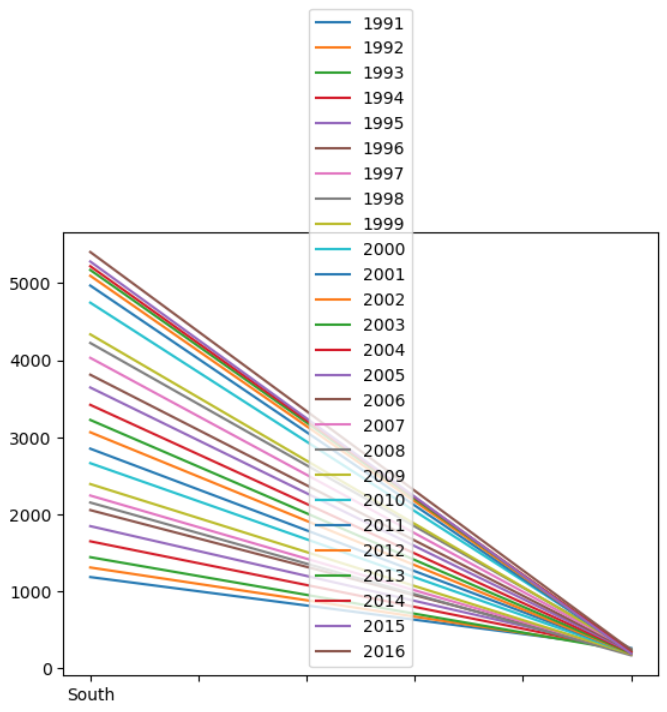

= 데이터 탐색

* pands는 DataFrame의 데이터 탐색을 위한 여러 기본 함수들을 제공함
** 데이터 내용 미리보기 +
_DataFrame_object.head()_ +
_DataFrame_object.tail()_
** 데이터 정보 요약 +
_DataFrame_object.shape_ +
_DataFrame_object.info()_ +
_DataFrame_object.describe()_
** 데이터 개수 +
_DataFrame_object.count()_ +
_DataFrame_object['column_name'].value_counts()_ +

== Sample Data

[%header, cols="1,1,1,1,1,1,1,2,1,3", width=100%]
|===
|	|mpg	|cylinders	|displayment	|horsepower	|weight	|acceleration	|model year	|origin	|name
|0	|18.0	|8	|307.0	|130.0	|3504.0	|12.0	|70	|1	|chevrolet chevelle malibu
|1	|15.0	|8	|350.0	|165.0	|3693.0	|11.5	|70	|1	|buick skylark 320
|2	|18.0	|8	|318.0	|150.0	|3436.0	|11.0	|70	|1	|plymouth satellite
|3	|16.0	|8	|304.0	|150.0	|3433.0	|12.0	|70	|1	|amc rebel sst
|...	|...	|...	|...	|...	|...	|...	|...	|...	|...
|395	|32.0	|4	|135.0	|84.00	|2295.0	|11.6	|82	|1	|dodge rampage
|396	|28.0	|4	|120.0	|79.00	|2625.0	|18.6	|82	|1	|ford ranger
|397	|31.0	|4	|119.0	|82.00	|2720.0	|19.4	|82	|1	|chevy s-10
|===

== 데이터 내용 미리보기

[%header, cols="1,2", width=50%]
|===
|함수|기능
|head()|데이터의 앞부분 출력
|tail()|데이터의 뒷부분 출력
|===

[source, python]
----
# 처음 지정된 개수의 row (기본값 5)
df_car.head()
df_car.head(10)

# 마지막 지정된 개수의 row (기본값 5)
df_car.tail()
df_car.tail(15)
----

== 데이터 요약 정보

[%header, cols="1,2", width=50%]
|===
|함수|기능
|shape|column과 row 개수 출력, 함수가 아닌 속성(attribute)
|info()|데이터의 뒷부분 출력
|===

[source, python]
----
# Data Frame의 메소드(함수)가 아닌 속성(Attribute)
df_car.shape

# Data Frame의 컬럼 속성
df_car.info()
----

== 데이터 개수

[%header, cols="1,2", width=80%]
|===
|함수|기능
|count()| row 수 출력
|_DataFrame_object['column_name'].value_counts()|row 데이터의 고유값 개수
|===

[source, python]
----
# 전체 DataFrame의 row 수 
df_car.count()
# 특정 컬럼에서 고유한 값의 수
df_car['horsepower'].value_counts()
df_car.horsepower.value_counts()
----

== 집계 함수

* 최소, 최대값 함수
+
_DataFrame_object['column_name'].max()_ +
_DataFrame_object['column_name'].min()_
* 합계
+
_DataFrame_object['column_name'].sum()_
* 평균과 중간값
+
_DataFrame_object['column_name'].mean()_
_DataFrame_object['column_name'].median()_
* 표준편차와 상관계수
_DataFrame_object['column_name'].std()_
_DataFrame_object.corr()_

=== 최대, 최소값

[%header, cols="1,2", width=50%]
|===
|함수|기능
|max()|해당 컬럼의 최대값
|min()|해당 컬럼의 최대값
|===

* 최대값
+
[source, python]
----
max(df_car['mpg'])      # python의 max 함수
df_car['mpg'].max()     # DataFrame column의 max 함수
df_car.mpg.max()        # DataFrame column의 max 함수
df_car.max()            # DataFrame 모든 column의 최대값
----
* 최소값
+
[source, python]
----
min(df_car['weight'])     # python의 min 함수
df_car['weight'].min()    # DataFrame column의 min 함수
df_car.weight.min()       # DataFrame column의 min 함수
df_car.min()              # DataFrame 모든 column의 최소값
----

=== 합계

[%header, cols="1,2", width=50%]
|===
|함수|기능
|sum()|해당 컬럼의 최대값
|===

* 합
+
[source, python]
----
sum(df2['math'])    # python의 sum 함수
df2['math'].sum()   # DataFrame column의 sum 함수
df2.math.sum()      # DataFrame column의 sum 함수
df.sum()            # 전체 DataFrame의 합계
----

=== 평균과 중간값

[%header, cols="1,2", width=50%]
|===
|함수|기능
|mean()|해당 컬럼의 평균값
|median()|해당 컬럼의 평균값
|===

* 평균 
+
[source, python]
----
sum(df_car['weight']) / len(df_car) # 나누기
df_car['weight'].mean()             # DataFrame column의 mean 함수
df_car.math.mean()                  # DataFrame column의 mean 함수
df_car.mean()                       # 전체 DataFrame의 평균
----

* 중간값
+
[source, python]
----
df_car['weight'].median()           # DataFrame column의 median 함수
df_car.weight.median()              # DataFrame column의 mean 함수
df_car.median()                     # 전체 DataFrame의 평균
----

=== 표준편차와 상관계수

[%header, cols="1,2", width=50%]
|===
|함수|기능
|std()|해당 컬럼의 표준편차
|corr()|DataFrame 또는 두 컬럼의 상관계수
|===

* 표준 편차
+
[source, python]
----
df_car['weight'].std()  # DataFrame column의 std 함수
df_car.weight.std()     # DataFrame column의 std 함수
df_car.std()            # 전체 DataFrame의 표준편차
----

* 상관 계수
+ 
[source, python]
----
df_car.corr()
df_car[['mpg','weight']].corr()
----

== 데이터 정보 요약

[%header, cols="1,2", width=50%]
|===
|함수|기능
|describe()|요약 통계량 출력
|===

[source, python]
----
# 요약 통계량
df_car.describe()
----

== Pandas 그래프 도구

* Pandas는 내장 그래프 도구를 제공
* 선 그래프 +
_DataFrame_object.plot()_
* 막대 그래프 +
_DataFrame_object.plot(kind='bar')_
* 히스토그램 +
_DataFrame_object.plot(kind='hist')_
* 산점도 +
_DataFrame_object.plot(x='column_name', y='column_name', kind='scatter')_
* 박스 플롯 +
_DataFrame_object.plot(kind='box')_

=== 선 그래프

* 가장 기본적인 그래프
* plot() 함수를 파라미터 없이 호출
+
_DataFrame_object.plot()_
+
[source, python]
----
df_gen = pd.read_excel('남북한발전전력량.xlsx')
df_ns = df_gen.iloc[[0, 5], 3:]
df_ns.index = ['South','North']
df_ns.columns = df_ns.columns.map(int)
df_ns.plot()
----
+

+
[source, python]
----
df_ns_trans = df_ns.transpose()
df_ns_trans.plot()
----
+

== 막대 그래프

* plot 함수의 kind 파라미터에 bar 옵션 사용
+
_DataFrame_object.plot(kind='bar')
+
[source, python]
----
df_ns_trans.plot(kind='bar')
----
+

== 히스토그램

* plot 함수의 kind 파라미터에 hist 옵션 사용
+
_DataFrame_object.plot(kind='hist')_
+
[source, python]
----
df_ns_trans.plot(kind='hist')
----
+

== 산점도

* plot 함수의 kind 파라미터에 scatter 옵션 사용
+
_DataFrame_object.plot(kind='scatter')_
+
[source, python]
----
df_car.plot(x='weight', y='mpg', kind='scatter')
----
+

== 박스 플롯

* 특정 변수의 데이터 분포와 분산 정도에 대한 정보제공
* plot 함수의 kind 파라미터에 box 옵션 사용
+
_DataFrame_object.plot(kind='box')_
+
[source, python]
----
df_car[['mpg', 'cylinders']].plot(kind='box')
----
+

