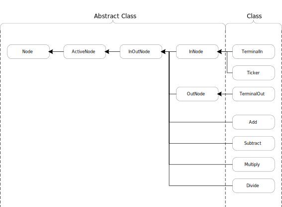
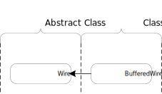

= SimpleFBP 만들기

SimpleFBP는 Flow-based Programmingfootnote:[https://en.wikipedia.org/wiki/Flow-based_programming[Flow-based programming]] 기법을 활용하여 프로그래밍 할 수 있는 도구 중에서 몇가지 기능을 구현해 본다.

**여기서는**

* FBP구현을 위한 구성요소들을 설계하고 구현해 본다.
* Class가 hierachy를 구성하여 subclassing, subtyping에 대해 연습한다.
* Class의 확장 또는 구현을 통해 overriding, overloading에 대해 연습한다.
* Thread 활용에 대해 연습한다.
* Data structure의 활용에 대해 연습한다.
* 연습과정에서 발생하는 문제 해결을 통해 debugging을 연습한다.
* Tool의 도움을 받아 문제가 될 수 있는 부분들을 제거한다.

{empty} + 

== FBP 구성 요소

**Node**

* Message 처리를 개별적으로 동작한다.
* Port를 통해 다른 node와 통신한다.
* 단일 기능 수행을 목적으로 한다.

{empty} + 

**Wire**

* Node간 message전달을 위해 사용된다.
* 하나 이상의 message를 보관할 수도 있다.
* 새로운 message가 들어오면, 전달할 node에게 이를 알릴 수 있다.

{empty} + 

**Message**

* Node간 전달할 데이터를 가지고 있다.
* 데이터의 종류에 따라 다양한 message가 생성될 수 있다.

image::image/message_hierachy.svg[title="Message Hierachy",align=center]

{empty} + 

== Node class

node의 기본 동작을 이해하고, 단위 기능별로 최소한의 기능을 수행하도록 설계하여 구현한다.

**특징**

* 개별 식별자를 갖는다
* 이름을 가고 있으며, 지정할 수도 있다.
* Instance를 생성할 수 없다.

**Field**

[cols="1,1,1,1,5"]
|===
^s|Field
^s|Class Variable
^s|외부 참조
^s|변경
^s|설명

^|id
^|아니오
^|가능
^|불가능
|모든 node는 고유의 식별자를 가지고, 이를 통해 관리될 수 있다.

^|name
^|아니오
^|가능
^|가능
|모든 node는 이름을 가질 수 있다. 단, 기본 이름은 자동으로 생성된다.

^|count
^|예
^|가능
^|불가능
|생성된 node 갯수를 관리하고, 고유한 식별자 생성을 위해서도 사용된다.
|===

{empty} + 

=== Exam-01. Node class를 구현하라.

Node class는 아래와 같이 정의 될 수 있다.

각 field들은 그 용도에 따라 setter와 getter를 가질 수 있다.

[source,java]
----
public abstract class Node {
  static Integer count;
  final String id;
  Logger logger;
  
  public Node() {...} // default constructor
  
  // getter & setter
}
----

{empty} +

== ActiveNode class

**특징**

* Node class의 subclass 이다.
* Instance를 생성할 수 없다.
* Thread를 이용해 실행 가능하도록 구성한다.
* 수행을 종료 시킬 수 있다.
* 수행을 멈출 수 있다.
* 멈춘 수행을 다시 동작 시킬 수 있다

**필드**

[cols="1,1,1,1,5"]
|===
^s|Field
^s|Class Variable
^s|외부 참조
^s|변경
^s|설명

^|thread
^|아니오
^|불가능
^|불가능
|ActiveNode를 실행할 Thread class의 instance

^|startTime
^|아니오
^|가능
^|불가능
|동작 시작 시간 (부가정보)

^|interval
^|아니오
^|가능
^|가능
|perform을 반복 수행할 시간 간격

^|defaultInterval
^|예
^|가능
^|가능
|perform을 반복 수행할 기본 시간 간격
|===

{empty} +

ActiveNode class는 아래와 같은 상태를 가질 수 있다.

[cols="1,5"]
|===
^s|상태
^s|설명

^s|start
|ActiveNode 동작 시작

^s|initialize
|object 동작 시작 후 내부적인 초기화 과정이 필요한 경우 수행된다.

^s|perform
|object의 주된 업무를 수행하는 단계로 확장을 통해 실체화된 class에서 주요 기능을 수행한다

^s|idle
|실행 node는 일정 주기를 가지로 main과 idle을 반복한다. main에서 주기 시간내에 수행 업무를 완료한 경우 idle에서 남는 시간을 대기한다.

^s|finalize
|object 동작을 완전히 중지 시킬 경우, 리소스 해지등의 정리 작업을 수행한다.

^s|terminated
|실행 node가 완전히 종료된다.
|===

{empty} +

=== Exam-02. ActiveNode class를 구현하라.

* ActiveNode는 thread를 이용해 단독으로 실행 가능한 node이다.
* Thread 시작후 initialize()를 통해 필요시 초기화 한다.
* 일정한 시간간격을 기준으로 지정된 작업 perform()을 반복 수행한다.
* 모든 작업이 완료되면 Finalize()를 통해 정리하고 수행을 종료한다.

[source,java]
----
public abstract class ActiveNode extends Node implements Runnable {
  Thread thread;  
  long startTime; 
  long interval;  
  
  public ActiveNode() {...} 
  public ActiveNode(String name) {...} 
  
  // getter & setter
  
}
----

{empty} +

== Message class

Message class는 node간 데이터 전달을 위해 이용되는 class로 생성 후 소멸까지 고유한 object로 유지된다.

**특징**

* 메시지 공통 사항으로 Message class를 구현한다.
* 모든 메시지는 고유의 아이디를 갖는다.
* 메시지 생성 시간을 갖는다.

**Field**

[cols="1,1,1,1,5"]
|===
^s|Field
^s|Class Variable
^s|외부 참조
^s|변경
^s|설명

^s|count
^|예
^|가능
^|불가능
|Object 총 생성 갯수

^s|id
^|아니오
^|가능
^|불가능
|Object 생성시 마다 부여되는 고유 식별자

^s|creationTime
^|아니오
^|가능
^|불가능
|Object 생성 시간을 나타낸다.
|===

{empty} +

=== Exam-03. Message class를 구현하라.

[source,java]
----
public abstract class Message {
  static int count;
  final String id;
  final long creationTime;
  
  public Message() {...}
  
  public String getId() {...}
  public long getCreationTime() {...}
} 
----

{empty} +

== Wire class

**특징**

* Node간 메시지를 전달을 위한 중계자이다.
* 종류에 따라 하나 이상의 메시지를 저장할 수 있다.
* 일반적으로 먼저 입력된 메시지를 우선 전달한다.

{empty} + 

**Field**

[cols="1,1,1,1,5"]
|===
^s|Field
^s|Class Variable
^s|외부 참조
^s|변경
^s|설명 

^s|count
^|예
^|가능
^|불가능
|Object 총 생성 갯수

^s|id
^|아니오
^|가능
^|불가능
|Object 생성시 마다 부여되는 고유 식별자

^s|queue
^|아니오
^|불가능
^|불가능
|입력되는 message를 저장하고, 요청시 먼저 입력된 message를 반환하기 위해 message를 저장하는 data structure object
|===

=== Exam-04. Node간 메시지 전달을 위한 Wire class를 구현하라.

{empty} + 

[source,java]
----
public class Wire {
    static int count;
    String id;
    Queue<Message> queue;

    public Wire() {
    }

    public void put(Message message) {
    }

    public boolean hasMessage() {
    }

    public Message get() {
    }
}
----

{empty} +

== InputNode class

=== Exam-05. InputNode class를 구현해 보자.

[source,java]
----
public abstract class InputNode extends ActiveNode {
    Wire[] wires;

    InputNode(int count) {...}

    public void connectOutputWire(int index, Wire wire) {...}

    public int getOutputWireCount() {...}

    public Wire getOutputWire(int index) {...}

    void output(Message message) {...}
}
----

{empty} + 

== OutputNode class

=== Exam-06. OutputNode class를 구현해 보자.

[source,java]
----
public abstract class OutputNode extends ActiveNode {
    Wire [] wires;

    OutputNode(int count) {...}

    public void connectInputWire(int index, Wire wire) {...}

    public int getInputWireCount() {...}

    public Wire getInputWire(int index) {...}
}
----

{empty} +

== InputOutputNode Class

=== Exam-07. InputOutputNode Class를 구현해 보자.

[source,java]
----
public abstract class InputOutputNode extends ActiveNode {

    Wire [] inputWires;
    Wire [] outputWires;

    InputOutputNode(int inputCount, int outputCount) {...}

    public void connectInputWire(int index, Wire wire) {...}

    public void connectOutputWire(int index, Wire wire) {...}

    public int getInputWireCount() {...}

    public Wire getInputWire(int index) {...}A

    public int getOutputWireCount() {...}

    public Wire getOutputWire(int index) {...}A

    void output(Message message) {...}
}
----

{empty} +

== TerminalInNode class

* 입력 node로서 표준 입력 node를 구현한다.
* 키보드의 입력을 받아 메시지로 전달한다.

{empty} +

=== Exam-08. TerminalInNode Class를 구현해 보자.

[source,java]
----
public class TerminalInNode extends InputNode {
    Scanner scanner;

    public TerminalInNode() {...}

    public TerminalInNode(int count) {...}

    @Override
    void perform() {...}
}
----

{empty} +

== TerminalOutNode class

* 출력 node로서 표준 출력 node를 구현합니다.
* 메시지로 전달받은 데이터를 터미널에 출력 합니다.

=== Exam-09. TerminalOutNode Class를 구현해 보자.

[source,java]
----
public class TerminalOutNode extends OutputNode {
    public TerminalOutNode() {...}

    public TerminalOutNode(int count) {...}

    @Override
    void perform() {...}
}
----

{empty} + 

== TimerNode Class

* 설정된 시간에 맞게 메시지를 생성하도록 구현한다.
* 정해진 시각이 되면 시간 메시지를 출력하도록 한다.
* 일정 시간 간격으로 시간 메시지를 출력하도록 한다.

{empty} + 

=== Exam-10. TimerNode Class를 구현해 보자.

[source,java]
----
public class TimerNode extends InputNode {
    public TimerNode(long interval) {...}

    @Override
    void perform() {...}
}
----

{empty} +

== 4칙 연산 node 설계와 구현

* 4칙 연산 node를 구현합니다.
* 2개의 입력 소켓으로 2개의 데이터를 받아 계산 후 출력합니다.
* 2개의 입력이 들어오기 전에는 연산을 수행하지 낳습니다. 

image::./image/Arithmetic_Operation1.svg[]

{empty} +

=== Exam-11. 더하기를 위한 AddNode class를 구현해 보자.

[source,java]
----
public class AddNode extends InputOutputNode {
    public AddNode() {...}

    @Override
    void perform() {... }
}
----

{empty} +

==== 덧셈 테스트 예

[source,java]
----
public class TestAddNode {
    public static void main(String[] args) {
        TimerNode inNode1 = new TimerNode(1000);
        TimerNode inNode2 = new TimerNode(1000);
        AddNode addNode = new AddNode();
        TerminalOutNode terminalNode = new TerminalOutNode();

        Wire wire1 = new BufferedWire();
        Wire wire2 = new BufferedWire();
        Wire wire3 = new BufferedWire();

        inNode1.connectOutputWire(0, wire1);
        inNode2.connectOutputWire(0, wire2);
        addNode.connectInputWire(0, wire1);
        addNode.connectInputWire(1, wire2);
        addNode.connectOutputWire(0, wire3);
        terminalNode.connectInputWire(0, wire3);

        terminalNode.start();
        addNode.start();
        inNode2.start();
        inNode1.start();
    }
}
----

{empty} +

=== Exam-12. 빼기를 위한 SubtractNode class를 구현해 보자.

=== Exam-13. 곱하기를 위한 MultiplyNode class를 구현해 보자.

=== Exam-14. 나누기를 위한 DivideNode class를 구현해 보자.

{empty} +

==== Exam-15. 복합연산 예

[source,java]
----
import com.nhnacademy.node.*;

public class TestArithmeticOperations {
    public static void main(String[] args) {
        TimerNode v1 = new TimerNode(1, TimerNode.Mode.COUNT);
        TimerNode v2 = new TimerNode(1, TimerNode.Mode.COUNT);
        TimerNode v3 = new TimerNode(1, TimerNode.Mode.COUNT);
        TimerNode v4 = new TimerNode(1, TimerNode.Mode.COUNT);
        AddNode addNode = new AddNode();
        SubtractNode subtractNode = new SubtractNode();
        MultiplyNode multiplyNode = new MultiplyNode();
        TerminalOutNode outNode = new TerminalOutNode();

        Wire wire1 = new BufferedWire();
        Wire wire2 = new BufferedWire();
        Wire wire3 = new BufferedWire();
        Wire wire4 = new BufferedWire();
        Wire wire5 = new BufferedWire();
        Wire wire6 = new BufferedWire();
        Wire wire7 = new BufferedWire();

        v1.connectOutputWire(0, wire1);
        v2.connectOutputWire(0, wire2);
        addNode.connectInputWire(0, wire1);
        addNode.connectInputWire(1, wire2);
        v3.connectOutputWire(0, wire3);
        v4.connectOutputWire(0, wire4);
        subtractNode.connectInputWire(0, wire3);
        subtractNode.connectInputWire(1, wire4);

        addNode.connectOutputWire(0, wire5);
        multiplicationNode.connectInputWire(0, wire5);
        subtractNode.connectOutputWire(0, wire6);
        multiplicatNode.connectInputWire(1, wire6);
        multiplyNode.connectOutputWire(0, wire7);
        outNode.connectInputWire(0, wire7);

        outNode.start();
        addNode.start();
        subtractNode.start();
        multiplyNode.start();
        v4.start();
        v3.start();
        v2.start();
        v1.start();
    }
}
----

{empty} + 

== 피보나치 수열 생성기 설계 및 구현

* 몇가지 node를 설계하여 피보나치 수열을 생성하는 생성기를 만든다
* 하나의 node를 직접 만들어 구현할 수도 있으나, 재활용 가능하도록 기능을 나누어 여러개의 node가 되도록 구성하라

아래 구성도는 node로 구성하여 만든 피보나치 수열 생성기를 나타낸다.

image::./image/fibonacci.svg[title="Fibonacci 수열"]

[cols="1,5"]
|===
^s|Node
^s|설명

^s| Clock
|일정 주기로 신호를 생성한다. 신호가 생성될때 마다 피보나치 수열의 다음 수가 계산되어 출력된다.

^s|Replication
|입력 받은 값은 2개의 출력으로 만든다.

^s|Latch
|입력되는 값을 클럭이 들어올때 마다 출력한다. 새롭게 업데이트든 값이 없는 경우, default를 돌려 준다.

^s|AddNode
|두 값을 더해 출력한다.

^s|Delay
|입력된 데이터를 지연 시켜 전달한다.

^s|Standard Output
|터미널로 값을 출력한다.
|===

{empty} + 

=== Exam-16. 피보나치 수열을 구현해 보자.

[source,java]
----
import com.nhnacademy.node.*;
import com.nhnacademy.wire.Wire;

public class TestFibonacciNode2 {
    public static void main(String[] args) {
        ClockNode2 clockNode = new ClockNode2("clock", 1000) ;
        LatchNode2 latchNode1 = new LatchNode2("latch1", 1.0) ;
        LatchNode2 latchNode2 = new LatchNode2("latch2", 0.0) ;
        DelayNode2 delayNode2 = new DelayNode2(100);
        ReplicationNode2 replicationNode1 = new ReplicationNode2("replication1");
        ReplicationNode2 replicationNode2 = new ReplicationNode2("replication2");
        ReplicationNode2 replicationNode3 = new ReplicationNode2("replication3");
        addNode2 addNode1 = new addNode2("add1");
        TerminalOutNode2 standardOutNode1 = new TerminalOutNode2("out1");

        clockNode.connect(0, replicationNode1.getInputPort(0));
        replicationNode1.connect(1, latchNode1.getInputPort(0));
        replicationNode1.connect(0, latchNode2.getInputPort(0));
        latchNode1.connect(0, replicationNode2.getInputPort(0));
        latchNode2.connect(0, addNode1.getInputPort(0));
        delayNode2.connect(0, latchNode2.getInputPort(1));
        replicationNode2.connect(0, delayNode2.getInputPort(0));
        replicationNode2.connect(1, addNode1.getInputPort(1));
        addNode1.connect(0, replicationNode3.getInputPort(0));
        replicationNode3.connect(0, standardOutNode1.getInputPort(0));
        replicationNode3.connect(1, latchNode1.getInputPort(1));

        standardOutNode1.start();
        replicationNode1.start();
        replicationNode2.start();
        replicationNode3.start();
        addNode1.start();
        delayNode2.start();
        latchNode2.start();
        latchNode1.start();
        clockNode.start();
    }
}
----

{empty} + 

== 메시지 서버 설계 및 구현

* node들의 지정된 메시지 서버를 통해 다른 node들에게 메시지를 전달할 수 있다.

* 메시지 서버와 전달 방법은 node의 외부에서 설정하거나 변경 가능하다.

메시지 서버는 아래 그림과 같이, 메시지를 받기 위한 메시지 큐와 서버가 관리해야 할 클라이언트들을 가지고 있다.

image::./image/Message_Server2.svg[]

메시지 서버를 이용할 경우, node들은 해당 메시지의 대상을 설정한 후 메시지 서버로 보낸다.

메시지 서버는 이를 받아 등록되어 있는 node들을 검색하고, node가 등록되어 있을 경우 해당 node로 메시지를 전송한다.

아래 구성은 계산 로직의 중간 연산 node에서 외부로 출력되는 발생할 경우, 이를 메시지로 전송하여 출력하는 걸 나타낸다.

image::./image/Messsage_Server.svg[]

{empty} + 

=== Exam-17. 메시지 서버 테스트 예

[source,java]
----
import com.nhnacademy.message.PostMessage;
import com.nhnacademy.node.*;
import com.nhnacademy.util.MessageServer;
import com.nhnacademy.wire.Wire;

public class TestMessageServerNode {
    public static void main(String[] args) {
        TimerNode v1 = new TimerNode(1, TimerNode.Mode.COUNT);
        TimerNode v2 = new TimerNode(1, TimerNode.Mode.COUNT);
        TimerNode v3 = new TimerNode(1, TimerNode.Mode.COUNT);
        TimerNode v4 = new TimerNode(1, TimerNode.Mode.COUNT);
        AddNode addNode = new AddNode();
        SubtractNode subtractNode = new SubtractNode();
        MultiplyNode multiplyNode = new MultiplyNode();

        TerminalOutNode outNode = new TerminalOutNode();
        Wire wire1 = new Wire();
        Wire wire2 = new Wire();
        Wire wire3 = new Wire();
        Wire wire4 = new Wire();
        Wire wire5 = new Wire();
        Wire wire6 = new Wire();
        Wire wire7 = new Wire();

        v1.connectOutput(0, wire1);
        v2.connectOutput(0, wire2);
        v3.connectOutput(0, wire3);
        v4.connectOutput(0, wire4);

        addNode.connectInput(0, wire1);
        addNode.connectInput(1, wire2);
        addNode.connectOutput(0, wire5);

        subtractionNode.connectInput(0, wire3);
        subtractionNode.connectInput(1, wire4);
        subtractionNode.connectOutput(0, wire6);

        multiplicationNode.connectInput(0, wire5);
        multiplicationNode.connectInput(1, wire6);
        multiplicationNode.connectOutput(0, wire7);

        outNode.connectInput(0, wire7);

        MessageServer.getGlobalServer().connect(addNode);
        MessageServer.getGlobalServer().connect(subtractNode);
        MessageServer.getGlobalServer().connect(multiplyNode);
        addNode.setTrace(
          (x, y)->MessageServer.getGlobalServer().postMessage(
            new PostMessage(x, outNode.getId(), y)));
        subtractionNode.setTrace(
          (x, y)->MessageServer.getGlobalServer().postMessage(
            new PostMessage(x, outNode.getId(), y)));
        multiplicationNode.setTrace(
          (x, y)->MessageServer.getGlobalServer().postMessage(
            new PostMessage(x, outNode.getId(), y)));

        outNode.start();
        addNode.start();
        subtractNode.start();
        multiplyNode.start();
        v4.start();
        v3.start();
        v2.start();
        v1.start();
    }
}
----

{empty} + 

=== Exam-18. TCP 클라이언트를 이용한 입/출력 설계 및 구현

* TCP 소켓 통신을 위한 클라이언트를 설계하고 구현한다
* TCP 입력 node는  TCP 클라이언트 node에 연결되어 TCP 클라이언트에서 수신하는 데이터를 받아 출력한다.
* TCP 출력 node는 TCP 클라이언트 node에 연결되어, 입력으로 들어오는 전송 데이터를 TCP 클라이언트를 이용해 전송한다. 

image::./image/TCP_Client.svg[]

{empty} + 

=== Exam-19. TCP 서버를 이용한 입/출력 설계 및 구현

* TCP 소켓 통신을 위한 서버를 설계하고 구현한다
* TCP 입력 node는  TCP 서버 node에 연결되어 TCP 서버에서 수신하는 데이터를 받아 출력한다.
* TCP 출력 node는 TCP 서버 node에 연결되어, 입력으로 들어오는 전송 데이터를 TCP 서버를 이용해 전송한다. 
* 서버에는 하나이상의 클라이언트 접속이 가능하고, 클라이언트간 데이터 공유도 가능하다.

image::./image/TCP_Server.svg[]

{empty} + 

=== Exam-20. MQTT client 설계 및 구현

* Eclipse Paho Java client를 이용한다

* MQTT 통신 지원을 위한 클라이언트를 구현한다.

image::./image/MQTT_Client.svg[]
