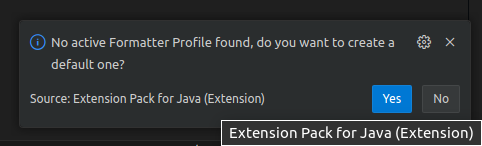

# VSCode Coding Convention 설정

## 코딩 컨벤션(Coding Convention)

* 어떤 프로그래밍 언어를 사용해서 코드를 작성할 때 추천되는 프로그래밍 스타일에 대한 가이드라인
* 사람이 코드를 읽기 좋도록 하고 유지보수를 용이하게 하기 위해 최대한 가이드를 따를 것을 권장함
* 들여쓰기, 주석(comment), 공백 갯수, 네이밍 컨벤션 등의 내용을 포괄함

## Why Have Code Conventions ?

* [참고] <https://www.oracle.com/java/technologies/javase/codeconventions-introduction.html>
* 80% of the lifetime cost of a piece of software goes to maintenance.
    * 소프트웨어를 개발하는 일련의 모든 과정에 들어가는 비용 중 80%가 유지보수
* Hardly any software is maintained for its whole life by the original author.
    * 소프트웨어의 유지보수를 그 소프트웨어를 직접 개발한 개발자가 담당하는 경우는 드물다
* Code conventions improve the readability of the software, allowing engineers to understand new code more quickly and thoroughly.
    * 코딩 컨벤션은 다른 개발자가 그 소스코드를 처음 보았을 때, 더 빠른 시간에 완벽히 이해할 수 있도록 도와주기 때문에, 코드의 가독성이 높아진다.
* If you ship your source code as a product, you need to make sure it is as well packaged and clean as any other product you create.
    * 개발자가 자신의 소스 코드를 제품으로 팔고자 한다면, 자신이 작성한 코드가 다른 소스코드들과 잘 어울리도록 패키지(package)를 적절하게 구성할 필요가 있다.

## Visual Studio Code 에서 Code Format 적용 방법

### Modify Setting 

1. 설정 열기 : `ctrl + ,`

2. `editor.detectIndentation` 설정을 검색하여 체크 해제

### Create Format.xml

1. 명령어 팔레트 열기 : `ctrl + shift + P` 

2. `Java: Open Java Formatter Settings` or `Java: Open Java Formatter Settings with Preview` 후자 추천

3. 우측 하단 팝업 Yes 선택

4. (Optional) java-formatter.xml 파일 화면이 나타나면 `Detect indentation from file content` 체크 해제

5. 우측의 미리보기 화면을 확인하면서 원하는 포맷을 만든다.

### Import External Xml

인터넷 혹은 로컬에 이미 존재하는 포맷 xml 파일이 있는 경우 사용할 수 있다.

1. 설정 열기 : `ctrl + ,` 

2. `java.format.settings.url` 설정을 검색하여 파일 경로를 등록
> ex)<a href="https://github.com/google/styleguide/blob/gh-pages/eclipse-java-google-style.xml" target="_blank">eclipse-java-google-style</a>  
https://raw.githubusercontent.com/google/styleguide/gh-pages/eclipse-java-google-style.xml

3. (Optional) xml 파일 태그에 Profile 이 존재한다면 `java.format.settings.profile` 설정을 이용해 선택 적용 가능

필요에 따라 자신의 깃허브와 같은 원격저장소에 xml 파일을 업로드하여 사용할수도 있음.

## VSCode CheckStyle 설정

### 1. CheckStyle 플러그인 설치
- Checkstyle for Java

### 2. CheckStyle 설정 파일 배치

1. 명령어 팔레트 열기 : `ctrl + shift + P` 

2. `Set the Checkstyle Configuration File`

3. Built-in 옵션 혹은 필요에 따라 파일 경로 넣기
> ex)<a href="https://github.com/checkstyle/checkstyle/blob/master/src/main/resources/google_checks.xml" target="_blank">google_checks</a>
https://raw.githubusercontent.com/checkstyle/checkstyle/master/src/main/resources/google_checks.xml

4. 적용한 체크 스타일과 코드 포맷에 따라 메시지를 확인할 수 있다.

