# SimpleFBP 만들기

SimpleFBP는 Flow-based Programming 기법을 활용하여 프로그래밍 할 수 있는 도구중에서 기본적인 몇가지 기능을 중심으로 구현함으로써,  동작 방식과 개발 기법 연습을 목적으로 한다.

## 노드만들기

노드의 기본 동작을 이해하고, 단위 기능별로 최소한의 기능을 수행하도록 설계하여 구현한다.

### 연습 1. 기본 노드(Node)의 설계 및 구현

구현할 노드는 아래와 같은 특징을 갖는다.

* 노드는 개별 식별자를 갖는다
* 노드는 이름을 가질 수 있다.
* 노드는 로거를 이용해 로그를 관리한다.
* 실체화 될 수 없다.
* 테스트는 확장 클래스를 이용한다.

기본 노드는 모든 노드들이 가져야할 공통적인 속성을 갖는다.

* id - 모든 노드는 고유의 식별자를 가지고, 이를 통해 관리될 수 있다.
* name - 모든 노드는 이름을 가질 수 있다. 단, 기본 이름은 자동으로 생성된다.
* logger - 객체의 상태나 동작 관련 메시지를 출력하여 개발을 지원한다.
* count - 생성된 노드 갯수를 관리하고, 고유한 식별자 생성을 위해서도 사용된다.

**클래스 구현**

Node 클래스는 아래와 같이 정의 될 수 있다.

각각의 필드들은 그 용도에 따라 setter와 getter를 가질 수 있다.

~~~java
public abstract class Node {
  static Integer count;
  final String id;
  Logger logger;
  
  public Node() {...} // 기본 생성자
  
  // getter & setter
}
~~~

### 연습 2. 실행 노드(ActiveNode)를 설계 및 구현

실행 노드는 아래와 같은 특징을 갖는다.

* 기본 노드에서 상속한다
* Thread를 이용해 실행 가능하도록 구성한다.
* 수행을 종료 시킬 수 있다.
* 수행을 멈출 수 있다.
* 멈춘 수행을 다시 동작 시킬 수 있다
* 기본 노드와 마찬가지로 실체화 될 수 없습니다.

실행 노드는 아래와 같은 동작 상태를 가질 수 있습니다.



* start - 실행 노드 동작 시작
* preprocess - 객체 동작 시작 후 내부적인 초기화 과정이 필요한 경우 수행된다.
* main - 객체의 주된 업무를 수행하는 단계로 확장을 통해 실체화된 클래스에서 주요 기능을 수행한다
* idle - 실행 노드는 일정 주기를 가지로 main과 idle을 반복한다. main에서 주기 시간내에 수행 업무를 완료한 경우 idle에서 남는 시간을 대기한다.
* postprocess - 객체 동작을 완전히 중지 시킬 경우, 리소스 해지등의 정리 작업을 수행한다.
* terminated - 실행 노드가 완전히 종료

**클래스 구현**

~~~java
public abstract class ActiveNode extends Node implements Runnable {
  Thread thread;  // ActiveNode를 구동 시켜줄 Thread
  long startTime; // 동작 시작 시각(동작 관리용)
  long interval;  // 내부적인 동작 주기
  
  public ActiveNode() {...} // 기본 생성자
  public ActiveNode(String name) {...} // 이름 지정 생성자
  
  // getter & setter
  
}
~~~

### 연습 3. 노드간 통신을 위한 메시지 설계 및 구현

메시지는 노드간 데이터 전달을 위해 이용되는 클래스로 생성 후 소멸까지 고유한 객체로 유지된다.

* 메시지 공통 사항으로 메시지 클래스를 구현합니다.
* 모든 메시지는 고유의 아이디를 갖습니다.
* 메시지 생성 시간을 갖습니다.
* 임의의 타입 객체를 payload로 갖는다.

**클래스 구현**

~~~java
public class Message {
  static int count;
  final String id;
  final long creationTime;
  
  public Message() {...}
  
  public String getId() {...}
  public long getCreationTime() {...}
}
~~~

### 연습 4. 노드간 메시지 전달의 설계와 구현



* 노드간 메시지를 전달한다

**InputPort 구현**

~~~java

public class InputPort {
    Node    node;
    Queue<Message> messageQueue;
    Lock locker;

    public InputPort(Node node) {
    }

    public void put(Message message) {
    }

    public boolean hasMessage() {
    }

    public Message get() {
    }

    public void remove() {
    }
}
~~~

**InputNode 구현**

~~~java
public abstract class InputNode extends ActiveNode {
    private final Port [] peerPorts;

    protected InputNode(int count) {...}

    public void connect(int index, InputPort port) {...}

    void output(Message message) {...}
}

~~~

**OutputNode 구현**

~~~java
public abstract class OutputNode extends ActiveNode {
    protected Port [] ports;

    protected OutputNode(int count) {...}

    public int getInputPortCount() {...}

    public InputPort getInputPort(int index) {...}
}

~~~

**InputOutputNode 구현**

~~~java
public abstract class InputOutputNode extends ActiveNode {

    private final Port [] ports;
    private final Port [] peerPorts;

    protected InputOutputNode(int inputCount, int outputCount) {...}

    public void connect(int index, InputPort port) {...}

    public int getInputPortCount() {...}

    public InputPort getInputPort(int index) {...}
    void output(Message message) {...}
}

~~~

### 연습 5. 표준 입력 노드 설계와 구현

* 입력 노드로서 표준 입력 노드를 구현합니다.
  * 키보드의 입력을 받아 메시지로 전달합니다.

**표준 입력 노드 클래스 구현**

~~~java
public class TerminalInNode extends InputNode {
    Scanner scanner;

    public TerminalInNode() {...}

    public TErminalInNode(int count) {...}

    @Override
    public synchronized void main() {...}
}
~~~

### 연습 6. 표준 출력 노드 설계와 구현

* 출력 노드로서 표준 출력 노드를 구현합니다.
  * 메시지로 전달받은 데이터를 터미널에 출력 합니다.

**표준 입력 노드 클래스 구현**

~~~java
public class TerminalOutNode extends OutputNode {
    public TerminalOutNode() {...}

    public TerminalOutNode(int count) {...}

    @Override
    public synchronized void main() {...}
}
~~~

### 연습 7. 타이머 노드 설계와 구현

* 설정된 시간에 맞게 메시지를 생성하도록 구현한다.
* 정해진 시각이 되면 시간 메시지를 출력하도록 한다.
* 일정 시간 간격으로 시간 메시지를 출력하도록 한다.

~~~java
public class TimerNode extends InputNode {
    public TimerNode(long interval) {...}

    public synchronized void main() {...}
}

~~~

### 연습 8. 4칙 연산 노드 설계와 구현

* 4칙 연산 노드를 구현합니다.
* 2개의 입력 소켓으로 2개의 데이터를 받아 계산 후 출력합니다.
* 2개의 입력이 들어오기 전에는 연산을 수행하지 낳습니다. 


**덧셈 클래스 구현 예**

```java
public class AdditionNode2 extends InputOutputNode2 {
    public AdditionNode() {...}

    public synchronized void main() {... }
}
```

**덧셈 테스트 예**

~~~java
public class TestAdditionNode {
    public static void main(String[] args) {
        RNGNode2 inNode1 = new RNGNode2(1000);
        RNGNode2 inNode2 = new RNGNode2(1000);
        AdditionNode2 additionNode = new AdditionNode2();

        TerminalOutNode2 outNode = new TerminalOutNode2();

        inNode1.connect(0, additionNode.getInputPort(0));
        inNode2.connect(0, additionNode.getInputPort(1));

        additionNode.connect(0, outNode.getInputPort(0));

        outNode.start();
        additionNode.start();
        inNode2.start();
        inNode1.start();
    }
}
~~~


**복합연산 예**

~~~java
import com.nhnacademy.node.*;

public class TestArithmeticOperations {
    public static void main(String[] args) {
        int interval = 1000;
        RNGNode2 v1 = new RNGNode2(interval);
        RNGNode2 v2 = new RNGNode2(interval);
        RNGNode2 v3 = new RNGNode2(interval);
        RNGNode2 v4 = new RNGNode2(interval);
        AdditionNode2 additionNode = new AdditionNode2();
        SubtractionNode2 subtractionNode = new SubtractionNode2();
        MultiplicationNode2 multiplicationNode = new MultiplicationNode2();

        TerminalOutNode2 outNode = new TerminalOutNode2();

        v1.connect(0, additionNode.getInputPort(0));
        v2.connect(0, additionNode.getInputPort(1));
        v3.connect(0, subtractionNode.getInputPort(0));
        v4.connect(0, subtractionNode.getInputPort(1));

        additionNode.connect(0, multiplicationNode.getInputPort(0));
        subtractionNode.connect(0, multiplicationNode.getInputPort(1));
        multiplicationNode.connect(0, outNode.getInputPort(0));

        outNode.start();
        additionNode.start();
        subtractionNode.start();
        multiplicationNode.start();
        v4.start();
        v3.start();
        v2.start();
        v1.start();
    }
}
~~~


### 연습 12. 피보나치 수열 생성기 설계 및 구현

* 몇가지 노드를 설계하여 피보나치 수열을 생성하는 생성기를 만든다
* 하나의 노드를 직접 만들어 구현할 수도 있으나, 재활용 가능하도록 기능을 나누어 여러개의 노드가 되도록 구성하라


아래 구성도는 노드로 구성하여 만든 피보나치 수열 생성기를 나타낸다.


* Clock : 일정 주기로 신호를 생성한다. 신호가 생성될때 마다 피보나치 수열의 다음 수가 계산되어 출력된다.
* Replication : 입력 받은 값은 2개의 출력으로 만든다.
* Latch : 입력되는 값을 클럭이 들어올때 마다 출력한다. 새롭게 업데이트든 값이 없는 경우, default를 돌려 준다.
* Addition : 두 값을 더해 출력한다.
* Delay : 입력된 데이터를 지연 시켜 전달한다.
* Standard Output : 터미널로 값을 출력한다.

**피보나트 수열 구성 예**

~~~java
import com.nhnacademy.node.*;
import com.nhnacademy.wire.Wire;

public class TestFibonacciNode2 {
    public static void main(String[] args) {
        ClockNode2 clockNode = new ClockNode2("clock", 1000) ;
        LatchNode2 latchNode1 = new LatchNode2("latch1", 1.0) ;
        LatchNode2 latchNode2 = new LatchNode2("latch2", 0.0) ;
        DelayNode2 delayNode2 = new DelayNode2(100);
        ReplicationNode2 replicationNode1 = new ReplicationNode2("replication1");
        ReplicationNode2 replicationNode2 = new ReplicationNode2("replication2");
        ReplicationNode2 replicationNode3 = new ReplicationNode2("replication3");
        AdditionNode2 additionNode1 = new AdditionNode2("addition1");
        TerminalOutNode2 standardOutNode1 = new TerminalOutNode2("out1");

        clockNode.connect(0, replicationNode1.getInputPort(0));
        replicationNode1.connect(1, latchNode1.getInputPort(0));
        replicationNode1.connect(0, latchNode2.getInputPort(0));
        latchNode1.connect(0, replicationNode2.getInputPort(0));
        latchNode2.connect(0, additionNode1.getInputPort(0));
        delayNode2.connect(0, latchNode2.getInputPort(1));
        replicationNode2.connect(0, delayNode2.getInputPort(0));
        replicationNode2.connect(1, additionNode1.getInputPort(1));
        additionNode1.connect(0, replicationNode3.getInputPort(0));
        replicationNode3.connect(0, standardOutNode1.getInputPort(0));
        replicationNode3.connect(1, latchNode1.getInputPort(1));

        standardOutNode1.start();
        replicationNode1.start();
        replicationNode2.start();
        replicationNode3.start();
        additionNode1.start();
        delayNode2.start();
        latchNode2.start();
        latchNode1.start();
        clockNode.start();
    }
}
~~~


### 연습 13. 메시지 서버 설계 및 구현

* 노드들의 지정된 메시지 서버를 통해 다른 노드들에게 메시지를 전달할 수 있다.

* 메시지 서버와 전달 방법은 노드의 외부에서 설정하거나 변경 가능하다.

메시지 서버는 아래 그림과 같이, 메시지를 받기 위한 메시지 큐와 서버가 관리해야 할 클라이언트들을 가지고 있다.


메시지 서버를 이용할 경우, 노드들은 해당 메시지의 대상을 설정한 후 메시지 서버로 보낸다.

메시지 서버는 이를 받아 등록되어 있는 노드들을 검색하고, 노드가 등록되어 있을 경우 해당 노드로 메시지를 전송한다.

아래 구성은 계산 로직의 중간 연산 노드에서 외부로 출력되는 발생할 경우, 이를 메시지로 전송하여 출력하는 걸 나타낸다.


**메시지 서버 테스트 예**

~~~java
import com.nhnacademy.message.PostMessage;
import com.nhnacademy.node.*;
import com.nhnacademy.util.MessageServer;
import com.nhnacademy.wire.Wire;

public class TestMessageServerNode {
    public static void main(String[] args) {
        RNGNode v1 = new RNGNode(1);
        RNGNode v2 = new RNGNode(1);
        RNGNode v3 = new RNGNode(1);
        RNGNode v4 = new RNGNode(1);
        AdditionNode additionNode = new AdditionNode();
        SubtractionNode subtractionNode = new SubtractionNode();
        MultiplicationNode multiplicationNode = new MultiplicationNode();

        TerminalOutNode outNode = new TerminalOutNode();
        Wire wire1 = new Wire();
        Wire wire2 = new Wire();
        Wire wire3 = new Wire();
        Wire wire4 = new Wire();
        Wire wire5 = new Wire();
        Wire wire6 = new Wire();
        Wire wire7 = new Wire();

        v1.connectOutput(0, wire1);
        v2.connectOutput(0, wire2);
        v3.connectOutput(0, wire3);
        v4.connectOutput(0, wire4);

        additionNode.connectInput(0, wire1);
        additionNode.connectInput(1, wire2);
        additionNode.connectOutput(0, wire5);

        subtractionNode.connectInput(0, wire3);
        subtractionNode.connectInput(1, wire4);
        subtractionNode.connectOutput(0, wire6);

        multiplicationNode.connectInput(0, wire5);
        multiplicationNode.connectInput(1, wire6);
        multiplicationNode.connectOutput(0, wire7);

        outNode.connectInput(0, wire7);

        MessageServer.getGlobalServer().connect(additionNode);
        MessageServer.getGlobalServer().connect(subtractionNode);
        MessageServer.getGlobalServer().connect(multiplicationNode);
        additionNode.setTrace(
          (x, y)->MessageServer.getGlobalServer().postMessage(
            new PostMessage(x, outNode.getId(), y)));
        subtractionNode.setTrace(
          (x, y)->MessageServer.getGlobalServer().postMessage(
            new PostMessage(x, outNode.getId(), y)));
        multiplicationNode.setTrace(
          (x, y)->MessageServer.getGlobalServer().postMessage(
            new PostMessage(x, outNode.getId(), y)));

        outNode.start();
        additionNode.start();
        subtractionNode.start();
        multiplicationNode.start();
        v4.start();
        v3.start();
        v2.start();
        v1.start();
    }
}
~~~


### 연습 14. TCP 클라이언트를 이용한 입/출력 설계 및 구현

* TCP 소켓 통신을 위한 클라이언트를 설계하고 구현한다
* TCP 입력 노드는  TCP 클라이언트 노드에 연결되어 TCP 클라이언트에서 수신하는 데이터를 받아 출력한다.
* TCP 출력 노드는 TCP 클라이언트 노드에 연결되어, 입력으로 들어오는 전송 데이터를 TCP 클라이언트를 이용해 전송한다. 


### 연습 15. TCP 서버를 이용한 입/출력 설계 및 구현

* TCP 소켓 통신을 위한 서버를 설계하고 구현한다
* TCP 입력 노드는  TCP 서버 노드에 연결되어 TCP 서버에서 수신하는 데이터를 받아 출력한다.
* TCP 출력 노드는 TCP 서버 노드에 연결되어, 입력으로 들어오는 전송 데이터를 TCP 서버를 이용해 전송한다. 
* 서버에는 하나이상의 클라이언트 접속이 가능하고, 클라이언트간 데이터 공유도 가능하다.


### 연습 16. MQTT client 설계 및 구현

* Eclipse Paho Java client를 이용한다

* MQTT 통신 지원을 위한 클라이언트를 구현한다.

   

## 유틸리티

유틸리티는 SimpleFBP를 만드는데, 필요한 각종 클래스들 말한다. FBP를 직접적으로 구성하는 요소들은 아니지만, 개발 과정에서 도움을 줄 수 있는 지원 요소들이다.

### 로거

로거는 객체가 동작함에 있어 발생되는 다양한 상태 메시지를 출력하도록 지원하기 위한 클래스이다.

로거를 통해 출력되는 로그는 다양한 단계를 가지고 있으며, 설정을 통해 출력되는 단계를 조절할 수 있다.

**로그 레벨**

* Info - 객체가 동작함에서 발생할 수 있는 각종 참고 정보
* Warning - 동작에 직접적으로 영향을 줄 위험 요소는 아니지만, 향후 위험 요소가 될 가능성이 있으므로 주의하여 관찰하고 수정하는 것이 좋다
* Error - 문제가 발생한 것으로 수정이 요구된다.
* Critical - Error와 같이 문제가 되지만, 재 실행전에 반드시 해결해야할 만큼의 아주 중요한 문제로 즉각적인 조치가 필요하다

~~~java
public class Logger {
  public Logger(String name) {...}
  
  public void debug(String message) {...}
  public void info(String message) {...}
  public void warning(String message) {...}
  public void error(String message) {...}
~~~

